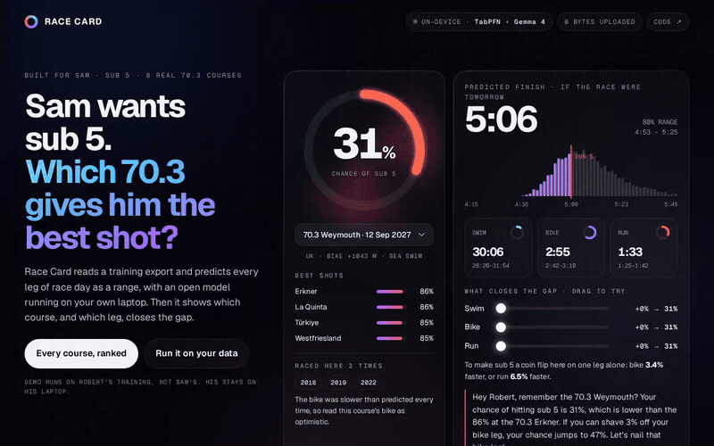

# Race Card



**Which IRONMAN 70.3 gives you the best shot at your goal time?** Race Card reads your own training
export, predicts every leg of race day as a range, and ranks eight real 70.3 courses by your chance of
going under the goal. Then it shows which leg would move that chance most.

It runs on your laptop with two open models, and nothing you've logged is uploaded anywhere.

**Live demo, built from my own Strava export:** https://iamrobertmoore.github.io/race-card/

I built it for my friend Sam, who wants to go under five hours at a 70.3 and hasn't picked which one.
His training is his, so I tested it on mine first.

## What it found on my data

- If I raced tomorrow: about 4:47 on the flat courses (around 86% chance of sub 5), about 5:06 at
  Weymouth (31%), 5:08 at Swansea (24%). The difference is almost all bike climbing.
- I had it predict 79 of my past race legs, each one using only the training I'd logged before that
  day. **62 of 79 landed inside its 80% range**, and the typical miss was 6.9%.
- On those same legs, with the same cut-off, simpler guesses missed by more: gradient-boosted trees
  trained on exactly the same rows 7.9%, "same as my last race at that distance" 8.3%, a straight-line
  fit 11.1%, my recent training pace 12.1%. It's not a landslide (TabPFN was closer than the trees on
  48 of 79 legs), but the trees give one number and TabPFN gives the range the whole card is built on.
- Gemma 4, on the laptop, read 1,005 of my activity titles in under three minutes and found 166 of
  the 181 races in my hand-checked list, with 6 false alarms. That's after two rounds of fixing the
  prompt against that same list, so it's a best case. Its first run took 47 minutes, until I turned its
  thinking off.
- I've raced Weymouth three times. It predicted my bike too fast every time, by 7 to 11%. So on the
  hilly courses, treat its bike numbers as optimistic.

## How it works

1. **Your export.** Strava's `activities.csv` (from *Download your data*) or a Garmin Connect
   Activities CSV.
2. **Gemma 4 finds your races** (via Ollama, on your machine). It reads your activity titles and picks
   out the ones that were races, so race-day effort is labelled without hand-tagging years of log.
3. **Features from your own log:** distance, climbing per km, how long ago, training load over the
   previous 7 and 42 days, and whether it was a race.
4. **TabPFN v2 predicts each leg.** Prior Labs' open tabular foundation model fits your sessions in
   seconds on a laptop CPU and returns a spread of likely speeds, not one number.
5. **20,000 simulated race days per course.** Each leg is drawn from its spread, transitions are added,
   and the share under your goal is your chance.
6. **Gemma 4 writes a short plan** from the computed numbers only. If it writes a number that isn't in
   the facts it was given, the note is thrown away.

The page itself is one static HTML file with the results inside it. The sliders re-run the simulation
in your browser.

## Run it on your own data

```bash
pip install git+https://github.com/iamrobertmoore/race-card
racecard path/to/activities.csv --name You --goal 5:00
```

That writes `race-card.html` and opens it. The first run downloads the TabPFN v2 weights from Hugging
Face (no account needed). If [Ollama](https://ollama.com) is running with `gemma4:e4b`, Gemma finds
your races and writes the note; without it, races are found by title keywords and the note is a plain
template.

Options: `--for Sam` (who the card is for), `--races races.json` (your own list of `[date, title]`),
`--no-backtest` (faster), `--no-gemma`.

The Gemma steps also run on their own, with nothing but Python's standard library:

```bash
python3 scripts/on_device.py races path/to/activities.csv --key my-races.json
python3 scripts/on_device.py note race-card.html
```

## Courses

Bike and run climbing come from IRONMAN's own course routes or finishers.com, checked 2 October 2026:
Weymouth, Swansea, Alcúdia-Mallorca, Portugal-Cascais, Türkiye, La Quinta, Erkner and Westfriesland.
Where a run's climbing isn't published it's treated as flat, and the page says which.

## What this is not

- It's a prediction for one person from their own logged training, not coaching or medical advice.
- It knows a course's distance and climbing, not heat, wind, sea state or a non-wetsuit swim.
- Legs are simulated independently, so the range is a little narrower than real life.
- Transitions are a flat 7 minutes.
- TabPFN v2 is licensed for non-commercial use, which is what this is.

## Tests

```bash
python -m pytest -q tests
```

## Credits

[TabPFN](https://github.com/PriorLabs/TabPFN) by Prior Labs · [Gemma](https://ai.google.dev/gemma) by
Google · [Ollama](https://ollama.com) · Geist and Geist Mono by Vercel. Built with Claude as a pair
programmer for the DEV Hacktoberfest Weekend Challenge, 2 to 5 October 2026.

MIT licence.
